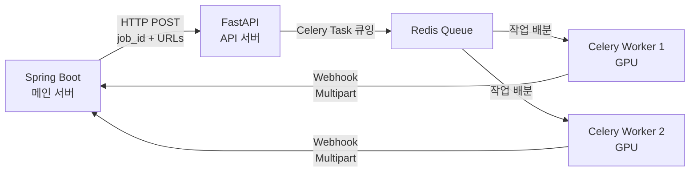

# 👗 VTO AI 워커 파이프라인 개발 명세서 및 블루프린트

본 문서는 DGX Spark (NVIDIA GB10, 128GB 통합 메모리, ARM64) 환경에서 FastAPI와 Celery를 활용하여 비동기 VTO(Virtual Try-On) 작업을 처리하기 위한 AI 워커 파이프라인의 설계 및 구현 명세서입니다.

---

## 🖥️ 서버 사양

| 항목 | 상세 |
|------|------|
| GPU | NVIDIA GB10 (Grace Blackwell Superchip) |
| 메모리 | 128GB 통합 메모리 (CPU + GPU 공유) |
| 아키텍처 | ARM64 (Grace CPU) |
| CUDA | 13.0 |
| Driver | 580.95.05 |
| OS | Linux (Ubuntu) |

---

## 🏗️ 시스템 아키텍처



---

## 🤖 AI 모델 구성

| 단계 | 모델 | 역할 | 출처 |
|------|------|------|------|
| 1악장 | **rembg** (u2net) | 옷 이미지 배경 제거 | [danielgatis/rembg](https://github.com/danielgatis/rembg) |
| 2악장 | **SAM 3** (Meta) | 텍스트 프롬프트로 옷 영역 마스크 추출 | [ai.meta.com/sam3](https://ai.meta.com/research/sam3/) |
| 3악장 | **IDM-VTON** | Stable Diffusion XL 기반 가상 피팅 합성 | [yisol/IDM-VTON](https://github.com/yisol/IDM-VTON) |

---

## 📁 프로젝트 구조

```
team2-simul-ai/
├── docker-compose.yml          # 전체 서비스 오케스트레이션
├── api/
│   ├── Dockerfile              # FastAPI 서버 컨테이너
│   ├── main.py                 # FastAPI 엔드포인트
│   └── requirements.txt        # API 서버 의존성
├── ai-worker/
│   ├── Dockerfile              # AI Worker 컨테이너 (CUDA 13.0, ARM64)
│   ├── tasks.py                # 5단계 VTO 파이프라인 (Celery Task)
│   ├── requirements.txt        # AI Worker 의존성
│   └── download_models.py      # 모델 가중치 사전 다운로드 스크립트
└── vto_ai_worker_blueprint.md  # 본 문서
```

---

## ⚙️ 파이프라인 상세

### 0단계: 모델 사전 적재 (Cold-start 방지)

`tasks.py` 모듈이 import 될 때(= Celery Worker 프로세스 시작 시) 전역 레벨에서 모든 모델을 VRAM에 **단 한 번만** 로딩합니다.

- `rembg_session`: rembg u2net 세션
- `sam3_model` / `sam3_processor`: SAM 3 이미지 세그멘테이션
- `pipe` (TryonPipeline): IDM-VTON SDXL 인페인팅 파이프라인

### 1악장 + 2악장: 병렬 처리

`ThreadPoolExecutor(max_workers=2)`로 동시 실행:

- **1악장 (rembg):** 옷 이미지 → 배경 제거 → 순수 옷 이미지
- **2악장 (SAM 3):** 사람 이미지 + 텍스트 프롬프트("upper body clothing") → 옷 영역 흑백 마스크

### 3악장: IDM-VTON 합성

- 사람 이미지, 전처리된 옷 이미지, 마스크를 IDM-VTON 파이프라인에 입력
- Negative Prompt: `bad anatomy, extra limbs, mutated hands, artifacts...`
- 해상도: 768×1024 (IDM-VTON 기본)
- Guidance Scale: 2.0, Inference Steps: 30

### 4악장: 안면 복원 (선택)

현재 비활성. 필요시 CodeFormer/GFPGAN 추가 가능.

### 5악장: 웹훅 전송

- `io.BytesIO`로 JPEG 인코딩 (디스크 I/O 없음)
- `requests.post()`로 Spring Boot 웹훅에 Multipart 전송
- 실패 시 `status: "FAILED"` + 에러 메시지 전송

---

## 🚀 배포 가이드

### 1. HuggingFace 인증 설정

SAM 3와 IDM-VTON 모델을 다운로드하려면 HuggingFace 토큰이 필요합니다:

```bash
# .env 파일 생성
echo "HUGGING_FACE_HUB_TOKEN=hf_your_token_here" > .env
```

### 2. 모델 가중치 사전 다운로드

Docker 볼륨에 모델을 미리 다운로드합니다:

```bash
docker-compose run --rm ai-worker python download_models.py
```

### 3. 서비스 시작

```bash
docker-compose up --build -d
```

### 4. 테스트 요청

```bash
curl -X POST http://localhost:80/api/v1/vto \
  -H "Content-Type: application/json" \
  -d '{
    "job_id": "test-001",
    "human_image_url": "https://example.com/person.jpg",
    "garment_image_url": "https://example.com/shirt.jpg"
  }'
```

예상 응답 (202 Accepted):
```json
{
  "message": "Job enqueued successfully",
  "task_id": "abc123...",
  "job_id": "test-001"
}
```

---

## 🛡️ 에러 핸들링

- Worker 프로세스는 어떤 예외에서도 **절대 종료되지 않음**
- `try-except`로 전체 파이프라인을 감싸고, 실패 시 웹훅으로 에러 리포트
- 웹훅 전송 자체가 실패해도 Worker는 다음 작업을 계속 처리
